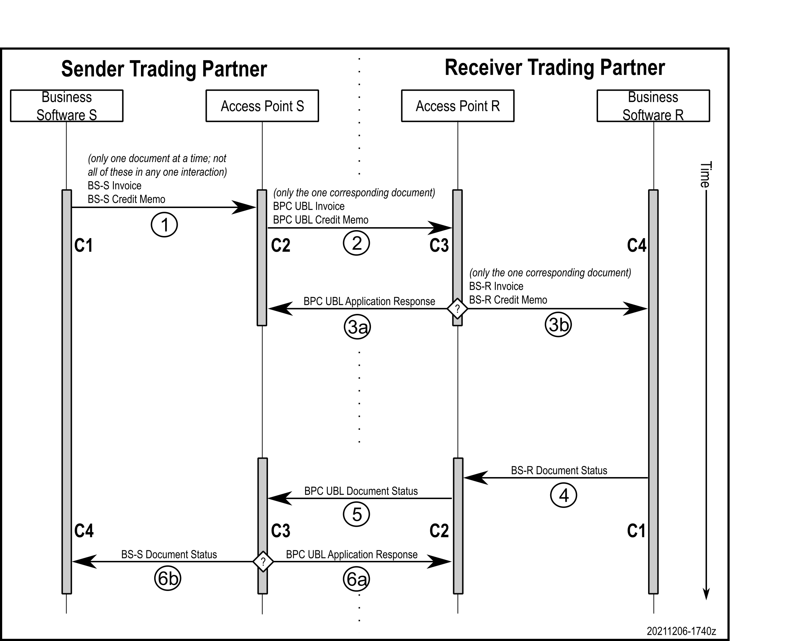

# A repository for tools related to the BPC Semantics spreadsheet

The [BPC Semantics Group spreadsheet](https://docs.google.com/spreadsheets/d/1qAz_aAbJ99ikA4zUk97FyjyDLcsQ3B3vqjEK-b3C_h8/view) is an artifact used to capture decisions by the Semantics Group regarding the document model and associated data integrity constraints imposed on corners 2 and 3 in the 4-corner model for semantic interoperability in data.

Various artifacts need to be created to help in the generation and validation of UBL documents in conformance with the subset and data integrity constraints defined by the BPC e-Invoicing Semantics Group.

_*IMPORTANT: This repository maintains the raw materials used to create the validation artifacts and not the validation artifacts themselves. Download the actual artefact files from [this repository's Actions tab](https://github.com/bpc-einvoicing/bpc-semantics-spreadsheet-tools/actions) using the most recent ZIP file. See below for triggering the creation of a new set of artifacts.*_

Find in the [BPC public directory](https://drive.google.com/drive/folders/1tvEwgiWcBaIr8GmE2_2RTy33vJsagn8M?usp=sharing) snapshot deliveries of the resulting artifacts created in the Actions tab.

This diagram outlines the role of a subset of UBL schemas in the generation of XML documents, independent of the role of the full UBL schemas when ingesting XML documents:

The three sets of artifacts identified in the diagram are numbered as follows:

1. The full UBL schemas without being subset.
1. The subset UBL schemas supporting only the constructs needed for XML generation, optionally used to structurally-validate the output before it is sent to the recipient.
1. The additional value constraints expressed in XSLT and authored using technologies such as ISO/IEC 19757-3 Schematron, OASIS Context/Value Association (CVA), OASIS genericode, or other means, used both to pre-validate the value constraints before the document is sent to the recipient, and to validate the value constraints after the document is received by the recipient.

The artifact labeled (1) comes from the OASIS UBL Technical Committee. The artifacts labeled (2) and (3) are created, respectively, indirectly and directly from the semantics spreadsheet.

## Message flow

In the flow labeled (1) the sender of the document acting as Corner 1 sends the semantic content of their document wrapped using whatever format that is compatible their own business system and is agreed to with Corner 2. In the flow labeled (2) Corner 2 uses UBL syntax to wrap the semantic information for Corner 3. In the two flows labeled (3) Corner 3 either (a) returns a failure message back to Corner 2 due to a failure interpreting the UBL syntax or violating the BPC data integrity constraints, or (b) passes the semantic content found in the UBL syntax to Corner 4 wrapped using whatever format is compatible with Corner 4’s business system and Corner 4 agrees to use.

Many, but not all, document types will trigger the need shown in the flow labeled (4) for the receiver trading partner to return to the sender a status of the document that was received when the receiver was acting as Corner 4. To do so, the receiver now acts as the new Corner 1 in the flow labeled (4), sending the document status in a private format to their access point now acting as the new Corner 2. In the flow labeled (5) the new Corner 2 sends the document status information wrapped in UBL syntax to the original sender’s access point now acting as the new Corner 3. In the two flows labeled (6) the new Corner 3 either (a) returns a failure message back to the new Corner 2 due to a failure interpreting the UBL syntax or violating the BPC data integrity constraints, or (b) passes the semantic content found in the UBL syntax to the original sender acting as the new Corner 4 wrapped using whatever format is compatible with Corner 4’s business system and Corner 4 agrees to use.

## Subset constraints XSD schema

The semantics spreadsheet produces a genericode input file that is used indirectly to a schema subsetting process to create the XSD schemas according to the subset specification for each of the identified business processes.

_Please note that at this time the subset schemas are not being produced; this is a future sub-project._

## Value constraints Schematron schema

The semantics spreadsheet produces a Schematron pattern for each of the identified business processes.

## Triggering the creation of a new set of artifacts from the spreadsheet

The artifacts are created from the Google spreadsheet whenever a change in the repository is committed and pushed. However, in many cases the spreadsheet will change but not the repository and so artifacts are not automatically created.

To trigger the creation of the artifacts after having changed the Google spreadsheet, create the `trigger.txt` file if it does not exist, or delete the `trigger.txt` file if it does exist, then commit this change to the repository. The commit comment can be something simple like "Create new artifacts from spreadsheet". From the "Code" tab in browser interface, use the "Add file" button at the top right to create `trigger.txt` (it can be empty). To delete an existing `trigger.txt`, click on the file name and then on the trash can icon.

Once triggered, the action progresses in the background on a server until complete, after which a ZIP of the artifacts can be downloaded from the "Actions" tab. A copy of the Google spreadsheet is included in the distribution `model/` directory. To get an email notification of the completion of the process, go to your personal settings under your profile picture, select "Notifications" from the groups on the left, and click "Email" under "GitHub Actions".

## Downloading the results

When not creating your own set of results, you can find in the [BPC public directory](https://drive.google.com/drive/folders/1tvEwgiWcBaIr8GmE2_2RTy33vJsagn8M?usp=sharing) snapshot deliveries of the resulting artifacts created in the Actions tab.

When creating your own set of results, from [this repository's Actions tab](https://github.com/bpc-einvoicing/bpc-semantics-spreadsheet-tools/actions) download the latest server ZIP file that has the name `bpc-semantics-github-{revision-date}.zip`. This ZIP file is doubly-wrapped as a necessity to transmit the information from the server using a generic name that cannot include the version number, only the revision date.

Unzipping this reveals the latest archive ZIP file that has the name `bpc-semantics-tools-{version}-{revision-date}.zip` including the version. This ZIP is used to snapshot the committee's work in some other location for posterity because the ZIP files on git are deleted after a period of time.

The archive ZIP contains all content to be snapshot by a committee for posterity:
- the `archive-only-not-in-final-distribution/` directory with a snapshot of all of the raw tools used in the generation of the distributed artifacts, and
- the `bpc-semantics-{version}-{revision-date}.zip` artifacts ZIP package to be made available to the BPC community of users.

The artifacts ZIP contains the following as described in detail in the included `readme-bpc-artifacts.html` file:
- UBL model information,
- BPC subset information,
- BPC semantic information, and
- a demonstration environment where the generated validation files can be exercised.

## Reviewing the results

In the downloaded artifacts a transcript of the server action is recorded in the `archive-only-not-in-final-distribution` directory in the file ending with "`console.{date}.txt`". If the results are incomplete and there are no other error indications, inspect this file for errors and report the problem to the repository maintainers by creating an issue.

The existence of the file `VALID-SEMANTICS-GC-FILE-NOT-GENERATED.txt` indicates a problem converting the spreadsheet into genericode in the first stage. Check the console transcript.

The existence of the file `VALID-SEMANTICS-XML-FILE-NOT-GENERATED.txt` indicates a problem converting the spreadsheet content into XML, otherwise there were no problems in the second stage. First check the "model" subdirectory for a file ending with "`errors.txt`". If that does not exist, then check the console transcript.

The existence of the file `ERROR-RUNNING-RESULTING-XSLT-FOR-P##-#######.txt` indicates a problem in the XPath of the Schematron generated for the process `P##` for the doctype `#######`. This file contains the report of the problems, as well as the file `bpc/P##/BPC-P##-#######-Data-Integrity-Constraints.error.txt`. Two steps are needed to determine where to fix the XPath problem:

1 - determine the line number from the error message, for example line 581 in this message:
  - `Static error near {...} on line 581 column 109 of BPC-P01-v0.1-Invoice-Data-Integrity-Constraints.xsl`
  - `XPST0017: Cannot find a 1-argument function named {http://www.w3.org/2005/xpath-functions}Count()`

2 - determine the spreadsheet row from that numbered line in the `bpc/P##/BPC-P##-v#.#-#######-Data-Integrity-Constraints.xsl` file (not the `bpc/P##/BPC-P##-#######-Data-Integrity-Constraints.xsl` file, but the one with `-v#.#` in the name), for example, row 71 of worksheet tab 1 for semantic NABG-999 in this line:
  - `test="Count(cac:PayeeParty/cac:Party/cac:PostalAddress) = 1 (:NABG-999 Tab 1 Row 71:)"`

## Documentation and demonstration - using the validation results

The `readme-bpc-artifacts.html` file in the downloaded ZIP describes the use of the validation artifacts that are produced by this process.

Note that the programmer's documentation of each of the XSLT stylesheets used in the generation is found in the `archive-only-not-in-final-distribution` directory of the downloaded ZIP. The Ant script governing the generation process also is found in that directory.

