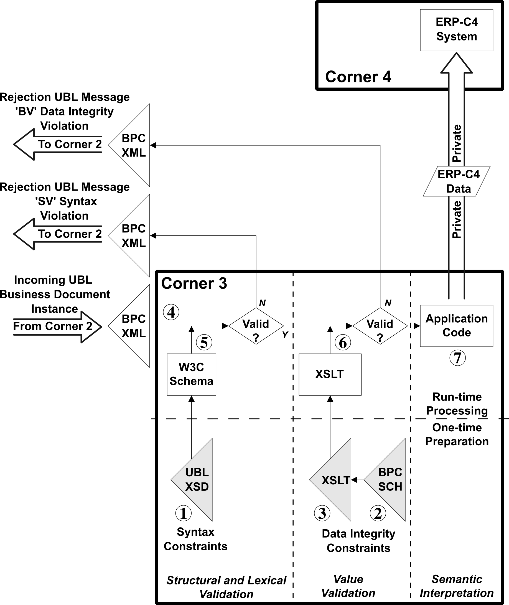
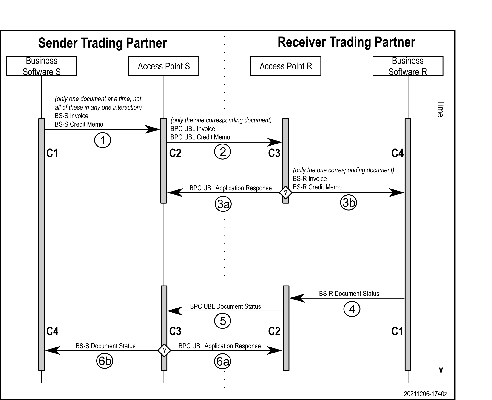
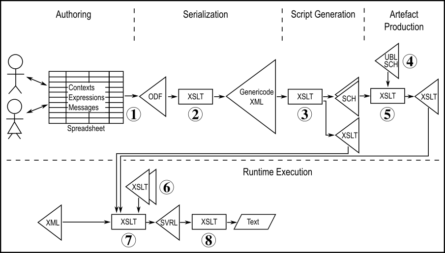

# A repository for tools related to the BPC Semantics spreadsheet

The [BPC Semantics Group spreadsheet](https://docs.google.com/spreadsheets/d/1qAz_aAbJ99ikA4zUk97FyjyDLcsQ3B3vqjEK-b3C_h8/view) is an artifact used to capture decisions by the Semantics Group regarding the document model and associated data integrity constraints imposed on Corner 2 and validated by Corner 3 in the 4-corner model for semantic interoperability in data.

_*IMPORTANT: This repository maintains the raw materials used to create the validation artifacts and not the validation artifacts themselves. Download the actual artefact files from [this repository's Actions tab](https://github.com/bpc-einvoicing/bpc-semantics-spreadsheet-tools/actions) using the most recent ZIP file. See below for triggering the creation of a new set of artifacts.*_

Find in the [BPC public directory](https://drive.google.com/drive/folders/1tvEwgiWcBaIr8GmE2_2RTy33vJsagn8M?usp=sharing) snapshot deliveries of the resulting artifacts created in the Actions tab.

This diagram outlines the role of the two validation artifacts, the UBL W3C XML schema and the BPC Schematron schema, in the validation of XML documents:



One-time preparation (before receiving first business document):

1. the OASIS committee has created a W3C XSD XML schema for all UBL documents
1. the BPC has created a Schematron (ISO/IEC 19757-3) schema for BPC data integrity rules
1. the BPC has created an XSLT runtime script for BPC data integrity rules

Run-time processing (does not require changes to one-time files):

4. the BPC business document in UBL XML format from Corner 2 arrives successfully at Corner 3 according to the AS4 transport protocol and AS4 receipt acknowledgement (AS4 processes not depicted)
4. using W3C XSD XML Schema validation, if the BPC XML breaks any UBL structural or lexical constraints then an 'SV' (syntax validation) rejection BPC XML message is sent back to Corner 2 and the work of Corner 3 is done
4. using XSLT transformation, if the BPC XML breaks any BPC data integrity constraints then a 'BV' (data integrity violation) rejection BPC XML message is sent back to Corner 2 and the work of Corner 3 is done
4. Corner 3 rearranges the business document information from UBL XML format to Corner 4's private data format and forwards it to Corner 4 and the work of Corner 3 is done


The artifact labeled (1) comes from the OASIS UBL Technical Committee. The artifacts labeled (2) and (3) are created, respectively, directly and indirectly from the semantics spreadsheet.

## Message flow

In the flow labeled (1) the sender of the document acting as Corner 1 sends the semantic content of their document wrapped using whatever format that is compatible their own business system and is agreed to with Corner 2. In the flow labeled (2) Corner 2 uses UBL syntax to wrap the semantic information for Corner 3. In the two flows labeled (3) Corner 3 either (a) returns a failure message back to Corner 2 due to a failure interpreting the UBL syntax or violating the BPC data integrity constraints, or (b) passes the semantic content found in the UBL syntax to Corner 4 wrapped using whatever format is compatible with Corner 4’s business system and Corner 4 agrees to use.



Many, but not all, document types will trigger the need shown in the flow labeled (4) for the receiver trading partner to return to the sender a status of the document that was received when the receiver was acting as Corner 4. To do so, the receiver now acts as the new Corner 1 in the flow labeled (4), sending the document status in a private format to their access point now acting as the new Corner 2. In the flow labeled (5) the new Corner 2 sends the document status information wrapped in UBL syntax to the original sender’s access point now acting as the new Corner 3. In the two flows labeled (6) the new Corner 3 either (a) returns a failure message back to the new Corner 2 due to a failure interpreting the UBL syntax or violating the BPC data integrity constraints, or (b) passes the semantic content found in the UBL syntax to the original sender acting as the new Corner 4 wrapped using whatever format is compatible with Corner 4’s business system and Corner 4 agrees to use.

## Value constraints Schematron schema

The semantics spreadsheet produces a Schematron pattern for each of the identified customizations.

**Important note**: A non-conformant convention is being used in the "UBL Context" column of the spreadsheet. The use of the '`#`' (octothorpe, hash, tic-tac-toe) character is an indication to replace the character with the document type. And the use of "`/#`" at the beginning of the string presumes the need for a namespace prefix. So the context string "`/#/cac:#Line`" because "`/Invoice:Invoice/cac:InvoiceLine`" or "`/CreditNote:CreditNote/cac:CreditNoteLine`" in the Schematron script. This is **not** a Schematron facility, but merely a typing shortcut in the BPC spreadsheet for specifying different expressions for different document types. The use of this does not work properly when used in the "Schematron Assertion" column, and so it is required to use "`/*/`" to specify the document element and not "`/#/`". When you need to use the literal `#` untouched, use `\#`. When you need to use the literal `\` untouched, use `\\`.

## The GitHub Action process creating the artifacts used at runtime

Each push to GitHub triggers a GitHub Action that builds the set of artefacts from the source spreadsheets. The action is defined in the `.github/workflows/build.yml` file. This simply establishes a build timestamp and it invokes the `prepareBPCartefacts-github.sh` bash script.

That bash script passes its arguments to the `prepareBPCartefacts.sh` bash script. At this time that is all that is being done, but the level of indirection leaves some flexibility in the future.

While the other bash scripts should not require any modifications, this bash script, in turn, may need to be edited to establish all of the variable parameters that describe the properties of the current build process. For example, version numbers and the base address of the Google spreadsheet (among other properties). Its final step is to invoke the `prepareBPCartefacts-common.sh` bash script. 

This final bash script, in turn, produces the results by invoking the `prepareBPCartefacts.xml` Apache Ant script and packaging the results.

In the following, these abbreviations are used:
- `WWWWWWW` - the document type e.g. Invoice
- `X.Y` - the version of the semantic library e.g. 0.3
- `ZZZ` - the customization name e.g. core, e.g. extended



1. The Google spreadsheet is exported as an ODF file.
1. The worksheets are extracted from the ODF file to create a genericode XML file of rows and columns.
1. The worksheets are analyzed to create for each customization of each document type two Schematron scripts: the shell `bpc/ZZZ/BPC-ZZZ-vX.Y-WWWWWWWW-Data-Integrity-Constraints.sch` script that imports other Schematron scripts, the detailed assertions `bpc/ZZZ/support/BPC-ZZZ-vX.Y-WWWWWWWW-Assertions.pattern.sch` script that is one of the scripts being imported, and the shell `bpc/ZZZ/BPC-ZZZ-WWWWWWWW-Data-Integrity-Constraints.xsl` XSLT runtime invocation artifact 
1. The other Schematron script that is imported is the `bpc/ZZZ/support/UBL-DocumentConstraints-2.3-pattern.sch` set of assertions obtained from the [http://docs.oasis-open.org/ubl/os-UBL-2.3/cva/](http://docs.oasis-open.org/ubl/os-UBL-2.3/cva/) directory.
1. The Schematron transformation process `pipeline-for-svrl.xsl` from the SchXSLT GitHub project at [https://github.com/schxslt/schxslt](https://github.com/schxslt/schxslt) (`schxslt-v.v.v-xslt-only.zip` release package unzipped and renamed into the `utilities/schematron/schxslt` subdirectory) interprets the Schematron scripts to create the runtime artefact `bpc/ZZZ/support/BPC-ZZZ-vX.Y-WWWWWWWW-Data-Integrity-Constraints.xsl` to be imported by the shell invocation stylesheet.
1. The two support stylesheets are maintained separately: the `bpc/ZZZ/support/BPC-vX.Y-Code-Lists.xsl` fragment (synthesized with `bpccodelists2xsl.xsl` as part of the GitHub Action processing; not depicted in this diagram) and the `bpc/ZZZ/support/BPC-Schematron-Support.xsl` fragment (authored by hand), both of which satisfy the custom BPC function invocations utilized in the authored spreadsheet expressions.
1. At runtime execution the XML to be analyzed is transformed into an XML instance of the Schematron Validation Results Language (SVRL) vocabulary using the `bpc/ZZZ/BPC-ZZZ-WWWWWWWW-Data-Integrity-Constraints.xsl` invocation stylesheet.
1. The `val/testSVRL4UBLerrors.xsl` XSLT stylesheet is used to interpret the SVRL results in the context of the demonstration validation test environment. Users can create their own interpretation of SVRL for their own production environment.

## Triggering the creation of a new set of artifacts from the spreadsheet

The artifacts are created from the Google spreadsheet whenever a change in the repository is committed and pushed. However, in many cases the spreadsheet will change but not the repository and so artifacts are not automatically created.

To trigger the creation of the artifacts after having changed the Google spreadsheet, create the `trigger.txt` file if it does not exist, or delete the `trigger.txt` file if it does exist, then commit this change to the repository. The commit comment can be something simple like "Create new artifacts from spreadsheet". From the "Code" tab in browser interface, use the "Add file" button at the top right to create `trigger.txt` (it can be empty). To delete an existing `trigger.txt`, click on the file name and then on the trash can icon.

Once triggered, the action progresses in the background on a server until complete, after which a ZIP of the artifacts can be downloaded from the "Actions" tab. A copy of the Google spreadsheet is included in the distribution `model/` directory. To get an email notification of the completion of the process, go to your personal settings under your profile picture, select "Notifications" from the groups on the left, and click "Email" under "GitHub Actions".

## Downloading the results

When not creating your own set of results, you can find in the [BPC public directory](https://drive.google.com/drive/folders/1tvEwgiWcBaIr8GmE2_2RTy33vJsagn8M?usp=sharing) snapshot deliveries of the resulting artifacts created in the Actions tab.

When creating your own set of results, from [this repository's Actions tab](https://github.com/bpc-einvoicing/bpc-semantics-spreadsheet-tools/actions) download the latest server ZIP file that has the name `bpc-semantics-github-{revision-date}.zip`. This ZIP file is doubly-wrapped as a necessity to transmit the information from the server using a generic name that cannot include the version number, only the revision date.

Unzipping this reveals the latest archive ZIP file that has the name `bpc-semantics-tools-{version}-{revision-date}.zip` including the version. This ZIP is used to snapshot the committee's work in some other location for posterity because the ZIP files on git are deleted after a period of time.

The archive ZIP contains all content to be snapshot by a committee for posterity:
- the `archive-only-not-in-final-distribution/` directory with a snapshot of all of the raw tools used in the generation of the distributed artifacts, and
- the `bpc-semantics-{version}-{revision-date}.zip` artifacts ZIP package to be made available to the BPC community of users.

The artifacts ZIP contains the following as described in detail in the included `readme-bpc-artifacts.html` file:
- UBL model information,
- BPC subset information,
- BPC semantic information, and
- a demonstration environment where the generated validation files can be exercised.

## Reviewing the validation stylesheet generation results

In the downloaded artifacts a transcript of the server action is recorded in the `archive-only-not-in-final-distribution` directory in the file ending with "`console.{date}.txt`". If the results are incomplete and there are no other error indications, inspect this file for errors and report the problem to the repository maintainers by creating an issue.

The existence of the file `VALID-SEMANTICS-GC-FILE-NOT-GENERATED.txt` indicates a problem converting the spreadsheet into genericode in the first stage. Check the console transcript.

The existence of the file `VALID-SEMANTICS-XML-FILE-NOT-GENERATED.txt` indicates a problem converting the spreadsheet content into XML, otherwise there were no problems in the second stage. First check the "model" subdirectory for a file ending with "`errors.txt`". If that does not exist, then check the console transcript.

In the following, these abbreviations are used:
- `WWWWWWW` - the document type e.g. Invoice
- `X.Y` - the version of the semantic library e.g. 0.3
- `ZZZ` - the customization name e.g. Core, e.g. Extended, e.g. Minimum

The existence of the file `ERROR-RUNNING-RESULTING-XSLT-FOR-ZZZ-WWWWWWW.txt` indicates a problem in the XPath of the Schematron generated. This file contains the report of the problems, as well as the file `bpc/ZZZ/BPC-ZZZ-WWWWWWW-Data-Integrity-Constraints.error.txt`. Two steps are needed to determine where to fix the XPath problem:

1 - determine the line number from the error message, for example line 581 in this message making reference to a function named "Count" instead of the XPath function named 'count':
  - `Static error near {...} on line 581 column 109 of BPC-core-v0.1-Invoice-Data-Integrity-Constraints.xsl`
  - `XPST0017: Cannot find a 1-argument function named {http://www.w3.org/2005/xpath-functions}Count()`

2 - determine the spreadsheet row from that numbered line in the `bpc/ZZZ/BPC-ZZZ-vX.Y-WWWWWWW-Data-Integrity-Constraints.xsl` file (not the `bpc/ZZZ/BPC-ZZZ-WWWWWWW-Data-Integrity-Constraints.xsl` file, but the one with `-vX.Y` in the name), for example, row 68 of worksheet tab 'Invoice, Credit Note' for semantic NABG-999 in this line:
  - `test="Count(cac:PartyLegalEntity/cbc:RegistrationName) = 1 (:NABT-59 Row 68 Tab 'Invoice, Credit Note':)"`

## User runtime error messages

When there are no Schematron errors reported when the build process is completed, the XSLT stylesheets created from the data integrity Schematron schemas are used to detect any violations in a given XML document. Violations are reported with the XPath address which includes the same spreadsheet citation as follows:

```
1. [IND5] Elements SHALL NOT be empty /Invoice/cac:AccountingCustomerParty[1]/
 cac:Party[1]/cac:PostalAddress[1]/cbc:PostalZone[1] / true()
2. Fewer or more than one trading name. /Invoice/cac:AccountingCustomerParty[1]
 / count(cac:Party/cac:PartyName/cbc:Name) = 1 (:NABT-045 Row 105 Tab
 'Invoice, Credit Note':)
Count of data errors: 2

INTERNAL ERROR 1. Suppressed rule: /Invoice:Invoice/cac:InvoiceLine (:NABG-026
 Row 249 Tab 'Invoice, Credit Note':)
Count of internal errors to be reported: 1


The following error report is simply the exit mechanism and can be ignored:
Error in xsl:message/@terminate on line 120 column 34 of testSVRL4UBLerrors.xsl:
  XTMM9000: Processing terminated by xsl:message at line 120 in testSVRL4UBLerrors.xsl
Processing terminated by xsl:message at line 120 in testSVRL4UBLerrors.xsl
```

An internal error reports a fault in the original BPC semantics spreadsheet leading to ambiguous matching contexts resulting in only the first of the contexts' rules being tested and not any of the rules of the matching contexts. End users are encouraged to report such internal errors back to the BPC Semantics Technical Subgroup to be addressed in the semantics spreadsheet.

## Documentation and demonstration - using the validation results

The `readme-bpc-artifacts.html` file in the downloaded ZIP describes the use of the validation artifacts that are produced by this process.

Included in the documentation are instructions for using the unzipped "`val/windows-drag-n-drop/`" directory.

Note that the programmer's documentation of each of the XSLT stylesheets used in the generation is found in the `archive-only-not-in-final-distribution` directory of the downloaded ZIP. The Ant script governing the generation process also is found in that directory.

## Check list for bumping version number of the release

When it comes time to change the version number of an X.Y release, such as from 0.3 to 0.4, these are the issues that need to be remembered (please add to the list if anything is missing):

1. Copy the spreadsheet for archive purposes, keeping "Copy of" in the copy's name
1. Change sharing of the new copy to be public view access and as few people as possible with rights to change content
1. Create and check out a GitHub branch named for the old version `Version X.Y` and modify the `prepareBPCartefacts.sh` in that branch to point to the new archived spreadsheet URL (in case there are maintenance releases needed); test the new branch
1. Change the name and the title of the original spreadsheet to the new version number (this preserves the spreadsheet URL for artefact production)
1. Remove "Copy of" from the archive copy's name and work with the archive old version now is complete
1. Check in the new branch to make the final snapshot ZIP files and attach to the check-in
1. Check out the main branch
1. Update the version number in the Schematron assertion columns of all worksheets for business terms NABT-023, NABT-024, NABT-1003, NABT-1004, NABT-2003, and NABT-2004
1. Update the sample XML instances in the GitHub base directory
1. Update the sample XML instances in the `raw/val` subdirectory
1. Update the sample XML instances in the `raw/examples` subdirectory
1. Update the test XML instances in the `raw/regression` subdirectory
1. Update the title of the `readme-bpc-artifacts.xml` document
1. Update the version number in the GitHub production invocation script `prepareBPCartefacts.sh` (see [GitHub Actions](#the-github-action-process-creating-the-artifacts-used-at-runtime) above for more information)
1. Update the code list creation environment for the new version number, recreate code lists using `sh make-BPC-code-lists.sh X.Y dateZ date`, and copy new code lists into raw directory
1. Check all subdirectories for the old version number: `find . -exec grep -l "\-X\.Y\-" {} \; 2>/dev/null | grep -v -E "(\.svg|\.gc|/utilities/|/.git/|\.md|\.xsd|\.html|\.jar|saxon)"`
1. Test the main branch before checking in
1. Check in the main branch


